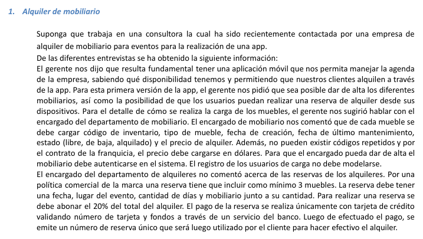

# eje1  👍

---

---

IDENTIFICAR LOS ACTORES

Usuario

Encargado Mobiliario

Servicio del banco

IDENTIFICAR CASOS DE USO

Reservar de alquiler 👍

Carga de muebles 👍

Iniciar sesion 👍

Cerrar sesion 👍

Pagar con tarjeta 👍

CONSTRUIR EL DIAGRAMA

**REALIZAR LOS ESCENARIOS**

Nombre del caso de uso: Reserva alquiler

Descripcion: En este caso de uso se describe el evento en el que un usuario realiza una reserva de alquiler

Actores: Usuario

PRECONDICIONES: NULL

CURSO NORMAL: 

| **Accion del Actor** | **Acciones del Sistema** |
| --- | --- |
| Paso1: El usuario le da al boton de reservar | Paso2: el sistema toma la peticion
y le muestra un formulario |
| Paso3: El usuario ingresa fecha, lugar del evento, cant de dias, 3 mobiliarios y le da al boton de reservar | Paso 4: el sistema valida los datos y verifica que tenga como minimo 3 muebles y lo redirige al pago (Otra CU) |
|  | Paso5: Se registra la reserva  |

Curso Alterno: 

Paso4 Alternativo:  el sistema valida que quiere reservar menos de 3 muebles y lo redirige al paso 2

Paso 4 Alternativo:  el sistema no tiene stock, lo redirige al Paso2

Paso 4 Alternativo: fallo del pago se informa al cliente,  se lo redirige al PASO3

PostCondicion: es verificada la reserva, es pagada, se emite el nro de reserva unico e informa que la reserva se ha realizado con exito

---

Nombre del caso de uso: Carga de muebles

Descripcion: Ese caso de uso describe el evento donde el Encargado Mobiliario carga muebles

Actores: Encargado de muebles

Precondiciones: estar autenticado

| Curso normal | Accion del actor | Accion del sistema |
| --- | --- | --- |
|  | Paso 1: el encargado le da al boton
de dar de alta/cargar un mueble | Paso 2: el sistema le muestra
un formulario, con los campos
cod de inventario, tipo de mueble, fecha de creacion, fecha de ultimo mantenimiento, estado, precio de alquiler |
|  | Paso 3: el encargado llena los campos con los datos del mueble, le da al boton de cargar | Paso 3: el sistema valida los datos y que el encargado este autenticado(Otra CU) |
|  |  | Paso4: se registra la carga |

Curso Altero:

Paso 3 Alterno: el sistema valida que ingreso un cod que ya se encuentra en el sistema, lo redirige al paso 3

PASO 3 Alterno: el sistema identifica que el precio se cargo en pesos, lo redirige al paso 3

POSTCONDICION: el mueble es dado de alta

---

Nombre del caso de uso: Iniciar sesion

Descripcion: En este caso se describe el evento en el que un encargado mobiliario va a iniciar sesion

Actores: encargado mobiliario registrado

PreCondiciones: debe estar registrado (el proceso de registro no dice la fuente como se hace)

| Curso normal | Accion del actor | Accion del sistema |
| --- | --- | --- |
|  | Paso 1: una persona registrada 
selecciona la opcion de iniciar sesion | Paso 2: el sistema solicita usuario y contrasenha |
|  | Paso3: el usuario registrado, ingresa el nombre de usuario, contrasenha | Paso 4: el sistema verifica los datos ingresados
Paso 5: el sistema registra la sesion iniciada y habilita las acciones del usuario registrado |

Curso Alterno: 

Paso alternativo 4: el usuario o contrasenha no son validas, se le notifica a la persona, lo redirige al paso 2

PostCondicion: La sesion ha sido iniciada y las opciones para usuarios registrados aparecen habilitadas

---

Nombre del caso de uso: Cerrar sesion

Descripcion: En caso de uso se describe el evento en el que un usuario registrado cierra la sesion

Actores: Usuario registrado

Precondicion:

| Curso normal | Accion del actor | Acciones del sistema |
| --- | --- | --- |
|  | Paso 1: el usuario registrado
selecciona la opcion de cerrar sesion | Paso 2: el sistema recibe la peticion y solicita la confirmacion del suario |
|  | Paso3: el usuario registrado confirma la operacion | Paso4: el sistema cierra sesion y deshabilita las acciones del usuario |

**Curso Alternativo:**

Paso 2 Alternativo: el usuario registrado no realiza la confirmacion. Fin del caso de uso

PostCondiciones: el usuario registrado, cerro sesion en el sistema y las opciones para usuarios registrados son deshabilitadas

---

Nombre del caso de uso: Pagar con tarjeta

Descripcion: en este caso de uso se describe el cobro de una reserva mediante una tarjeta

Actores: Usuarios, Servicio del banco

PreCondiciones: se debe ejecutar la CU “Realizar reserva de alquiler”

| Curso normal | Accion del actor | Accion del sistema |
| --- | --- | --- |
|  | Paso2: el usuario registrado, ingresa los datos | Paso1: el sistema solicita el nro de tarjeta y
cod de seguridad |
|  | Paso4: el servicio del banco, acepta la conexion y solicita el nro y cod de seguridad de la tarjeta | Paso 3: el sistema estable conexion con el servicio del banco |
|  |  | Paso5:  el sistema envia los datos de la tarjeta al servidor |
|  | Paso6: el servidor externov valida los datos y fondos suficientes | Paso 8: el sistema recibe los datos de la tarjeta, son correctos |
|  | Paso7: el servidor externo retorna el resultado | Paso 9: el sistema recibe que los fondos son suficientes |
|  |  | Paso 10: el sistema registra el pago y cierra la conexion con el servidor externo |

Curso Alterno:

Paso alternativo 3: Falla la conexion con el servidor externo. Se informa el error. Fin de CU

Paso alternativo 8: La validacion es incorrecta. Se informa error de validacion. Fin de CU

Paso alternativo 9: FOndos insuficientes. Se informa el problema. Fin de CU

