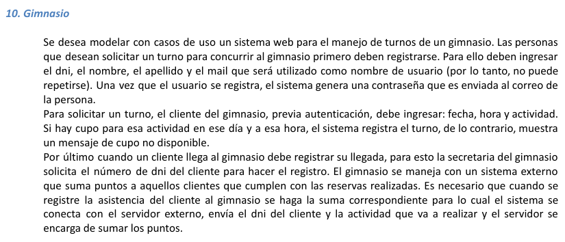

# eje10 👍

---

Actores: 

Persona

Cliente

Secretaria 

Servidor Externo

Casos de uso: 

Registrarse            V

Solicitar un Turno V

Registrar llegada V

~~Conectarse al servidor externo~~, sumar puntos V aaaaaaaaaa

Iniciar Sesion V

Cerrar Sesion V

Diagrama:

ESCENARIOS:

Nombre de Casos de Uso: Registrarse

Descripción:

Este caso caso de uso, permite registrar a un usuario

Actores: 

Persona

Precondiciones:

Null

| Curso Normal | Accion del Actor | Acciones del Sistema |
| --- | --- | --- |
|  | Paso 1: la persona no registrada le da al boton de registrase | Paso 2: el sistema le solicita el dni, nombre, apellido, mail unico |
|  | Paso 3: la persona llena los datos, con su informacion y le da al boton de registrarse | Paso 4: el sistema valida los datos |
|  |  | Paso 5: el sistema registra al cliente. |

Curso Alterno:

Paso 4 Alternativo: el mail ya se encuentra registrador en el sistema y no se registra a la persona. Fin de caso de uso

PostCondiciones:

dado un usuario no registrado que se registra de manera exitosa, el sistema lo registra y le envia una contrasenha por el mail

---

Nombre del caso de uso: Solicitar un Turno

Descripcion: en este caso se describe el evento en que los clientes Solicitan turnos

Actores: 

Cliente

PreCondiciones:

El cliente debe estar registrado y haber iniciado sesion (Otra CU) 

| Curso normal | Accion del Actor | Acciones del sistema |
| --- | --- | --- |
|  | Paso 1: el cliente le da al boton de solicitar turno | Paso 2: el sistema le da un formulario para llenar, fecha, hora y actividad |
|  | Paso3: el cliente, llena los datos del formulario y le da al boton de Solicitar turno | Paso4: el sistema valida los datos y verifica que haya cupo para esa actividad en ese dia y hora |
|  |  | Paso 5: el sistema registra el turno |

Se registro el turno

Curso Alterno: 

Paso 4: los datos ingresados no son validos, lo redirige al PASO 2

Paso 4: no hay cupo disponible. Termina la CU

PostCondicion:

---

Nombre del caso de uso: Registrar llegada 

Descripcion: Permitir a la secretaria registrar la llegada de un cliente

Actores:

Secretaria, Cliente

PreCondicion: haber solicitado un turno y ser un cliente registrado

| Curso normal | Accion del actor | Acciones del sistema |
| --- | --- | --- |
|  | 1:  la secretaria le solicita el nro de dni al cliente | 3: El sistema valida, que sea un nro de dni valido |
|  | 2: la secretaria, carga el nro de dni en el sistema y le da al boton de Registrar llegada | 4: se conecta con el servidor externo, envia dni del cliente y la actividad que va a realizar |
|  |  | 5- se realiza la CU, de sumar puntos |

Curso Alterno:

Paso 3 alterno: el nro no es valido y se redirige al paso 1

Paso 4 alterno:  fallo en la CU de sumar puntos. Fin de la CU

PostCondiciones: 

Registrar llegada

---

Nombre de la cu: Conectarse al servidor externo, sumar puntos

Descripcion: en este caso de uso se ve el evento de que el sistema se conecte al servidor externo para sumar puntos a un cliente

Precondicion:  se debe haber ejecutado la CU de registrar llegada

Actores:

Servidor Externo

Ticki Tacka

| Curso normal | Accion del actor | Acciones del sistema |
| --- | --- | --- |
|  | paso2: el sevidor  acepta la conexion y le pide un dni y actividad | pas1: el sistema se solicita con el servidor externo |
|  | pas4: el servidor externo, se encarga de sumar los puntos y cierra la conexion con el sistema | pas3: el sistema le envia un dni y una actividad |

Curso Alterno:

paso 3: no se le envian datos validos, FIN DE LA CU

paso 3: fallo en establecer una conexion con el servidor externo, Fin del CU

PostCondiciones:

Sumar los puntos al dni pasado

---

Nombre del caso de uso: Iniciar Sesion

Descripcion: Especifica el modo en el que un usuario registrado, inicia sesion con su mail y contrasenha

PreCondicion: Null

Actores:

Cliente

| Curso Normal | Accion del actor | Acciones del sistema |
| --- | --- | --- |
|  | paso1: el cliente registrado selecciona la opcion de iniciar sesion | Paso3: el sistema le muestra un formulario, que le pide su mail y contrasenha  |
|  | paso3: el cliente ingresa su mail y contrasenha en el sistema, le da al boton de iniciar sesion | paso 4: el sistema valida los datos  |
|  |  | Paso 5: el sistema registra la sesion iniciada y habilitada los acciones/funciones del cliente  |
|  |  |  |

Curso Alterno:

Paso 4 alterno:  el usuario y contrasenha ingresados no son validos, se notifica y lo redirige al paso paso 3

PostCondicion:

la sesion ha sido iniciada

---

Nombre del caso de uso: Cerrar Sesion

Descripcion: dado una sesion iniciada, se va cerrar sesion

Actores: Cliente

PreCondiciones:

| Curso normal | Accion del actor | Acciones del sistema |
| --- | --- | --- |
|  | 1: El cliente selecciona la opcion de cerrar sesion | 2: el sistema le pide una confirmacion de cierre de sesion |
|  | paso3: el cliente confirma el cierre | paso4: el sistema cierra la sesion de manera correcta |

Caso Alterno:

paso3 alterno: el cliente refhaza la confirmacion. FIN DE LA CU 

PostCondiciones:

Cerrar la sesion 

