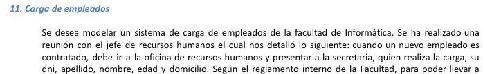

# eje11_v2 👍

---

---

Actores: 

Empleado

Secretaria

Servidor de Morosidad

Casos de uso:

Realizar Carga

Asociar Obra Social

Avisar regularizacion

Consultar Morosidad

Diagrama:

Nombre caso de uso: Realizar la carga

Descripcion: en este caso de uso se detalla como la secretaria realiza la carga de datos del empleado (no cargado)

Actores: 

secretaria

preCondicion:

Null pointer

| Curso Normal | Accciones del actor | Acciones del sistema |
| --- | --- | --- |
|  | 1: la secretaria selecciona “Realizar carga” | 2: el sistema le muestra un formulario, donde tiene los campos, dni, apellido, nombre, edad y domicilio |
|  | 3: la secretaria, carga los datos y selecciona “verificar” | 4: el sistema valida los datos |
|  |  | 5: el sistema verifica que el nuevo agente no figure en la base de sumarios |
|  |  | 6: el sistema registra la carga del agente |

Curso Alterno:

Paso 4 alterno: el sistema valida que no se ingresaron todos los datos, informa “no se han cargado todos los datos” y la redirige al paso 2

Paso 5: el sistema valida que el agente, figura en la base de sumarios, informa “el agente se encuentra en la base de sumarios” y cancela la carga. FIN de la CU

PostCondicion:

Que un nuevo empleado, quede registrado en el sistema

---

Nombre de la cu: Asociar Obra Social

Descripcion: En este caso de uso se describe como la secretaria le asigna una obra social al empleado

Actores: Null

PreCondiciones: 

| Curso Normal | Acciones del actor | Acciones del sistema |
| --- | --- | --- |
|  | 1: la secretaria selecciona “asociar obra social” | 2: el sistema le pide un nro de dni |
|  | 2: la secretaria ingresa el nro de dni y le da al boton de “enviar” | 3: el sistema valida el dni |
|  |  | 4: el sistema consulta a un servidor si el agente es moroso (se ejecuta la CU de consultar morosidad) |
|  |  | 5: el sistema verifica el estado del agente |
|  |  | 6: el sistema le asocia la obra social e imprime un carnet |

Curso Alterno:

paso 3 alterno: el dni no contiene caracteres valido. Fin de CU

paso 4: Fallo CU de consultar morosidad. FIN CU

paso 5:  el sistema verifica que es un agente moroso, se informa dicha situacion “Regularizar su sitacion en los proximos 30 dias” e imprime un codigo de inicio de tramite. FIN de CU

PostCondicion: 

Dado un agente/empleado registrado no moroso se le asigna una obra social exitosamente e imprime un carnet.

---

Nombre del caso de uso: Avisar regularizacion

Descripcion: en este caso de uso se describe como un empleado avisa la regularizacion de su deuda

Actores:

Empleado

PreCondicion:

| Curso Normal | Acciones del Actor | Acciones del sistema |
| --- | --- | --- |
|  | 1: el empleado selecciona “regularizar deuda” | 2: el sistema le pide un nro de dni y codDeTramite |
|  | 3: el empleado ingresa su nro de dni, codDeTramite y selecciona “Avisar” | 4: el sistema valida el dni |
|  |  | 5: el sistema valida el nro de socio |
|  |  | 6: el sistema verifica el estado del agente |
|  |  | 7: el verifica si ya pasaron los 30 de regularizar su situacion |
|  |  | 8: el sistema consulta si el agente sigue siendo moroso (Se ejecuta la CU de consultar morosidad) |
|  |  | 9: el sistema verifica el estado del agente |
|  |  | 10: el sistema le asocia la obra social e imprime un carnet |

Curso alterno:

paso4: el dni ingresado no es valido. Se lo redirige al paso 2

paso 5: el nro de socio ingresado no es valido. Se lo redirige al paso 2

paso 7: ya pasaron 30 dias, se informa. FIN DE LA CU

paso 8: falla la CU de consultar morosidad. FIN DE LA CU

paso 9: el agente sigue siendo moroso, se informa. FIN DE LA CU

PostCondicion: que un empleado moroso, deje de ser moroso y se le asigne una obra social e imprima un carnet

---

Nombre de la cu: Consultar Morosidad

Descripcion: en esta CU se describe como el sistema consulta la morosidad con un servidor

Actores: servidor de morosidad

PreCondicion: Haber ejecutado la CU ¨Realizar la carga ¨ o ¨Asociar Obra social¨

| Curso Normal | Acciones del usuario | Acciones del sistema |
| --- | --- | --- |
|  | 2: el servidor externo acepta la conexion y le pide un nro de de dni  | 1: el sistema solicita establecer una conexion con el servidor externo |
|  | 4: el servidor externo valida el dni  | 3: el sistema, le envia un nro de dni  |
|  | 5: el servidor externo retorna al sistema el resultado | 7: el sistema valida la informacion retornada |
|  | 6: el servidor externo cierra la conexion |  |

Curso Alterno: 

     2: el sistema externo rechaza la peticion. Fin de cu
PostCondicion:

Verificar si un nro de  dni corresponde a un agente moroso