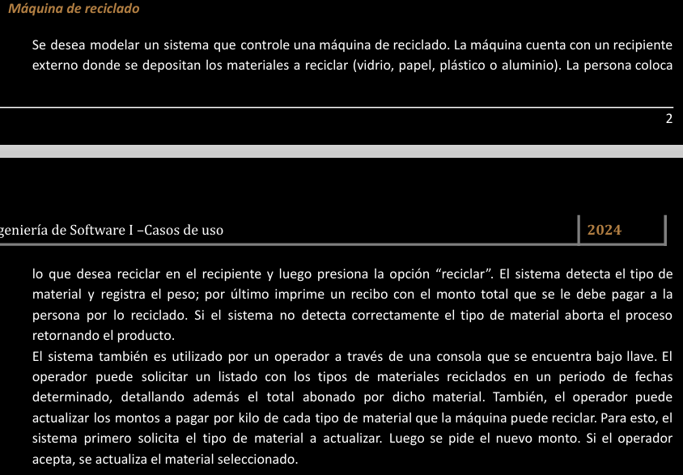

# eje4 👍

---

Actores:

Operador

Persona

Casos de uso:

Reciclar

Solicitar Listado

Actualizar Montos

Diagrama:

Nombre del caso de uso: Reciclar

Descripcion: En este caso de uso se describen los pasos para que una persona recicle

Actores:

Persona

PreCondicion:

null

| Curso Normal | Acciones del actor | Acciones del sistema |
| --- | --- | --- |
|  | 1: la persona presiona “reciclar” | 2: el sistema verifica el recipiente externo |
|  |  | 3: el sistema detecta el tipo de material |
|  |  | 4: el sistema registra el peso |
|  |  | 5: el sistema imprime un recibo con el monto total que debe pagar |

Curso Alterno:

2: el sistema no detecta ningun producto. Fin de la cu

3: el sistema no detecta el tipo de material a reciclar, informa y retorna el producto . Fin de la cu

(se podria poner un paso 5 alternativo de no tiene mas papel para imprimir un recibo, pero como modelarlo no se me ocurre
no deberia finalizar la cu, pero deberia contemplar ese caso
)

PostCondiciones: 

imprimir recibo con el monto total que se le debe pagar

---

Nombre del caso de uso: Solicitar Un listado

Descripcion: en este caso de se describen los pasos que realiza un operador para solicitar un listado

Actores:

Operador

PreCondicion:

null

| Curso Normal | Acciones del actor | Acciones del sistema |
| --- | --- | --- |
|  | 1: el operador selecciona “solicitar listado” | 2: el sistema le pide un periodo de fechas  |
|  | 3: el operador ingresa los datos y le da al boton de siguiente | 4: el sistema verifica los datos |
|  |  | 5: el sistema retorna un listado en un periodo de fechas, detallando el total abonado por dicho material. |

Curso Alterno:

4: no hay listado disponible para las fechas ingresadas.. Se informa. Fin de la cu

PostCondiciones: 

solicitar un listado en un rango de fechas

---

Nombre del caso de uso: actualizar montos

Descripcion: en este caso de uso se describen los paso para que un operador actualice los montos

Actores:

operador

PreCondicion:

null

| Curso Normal | Acciones del actor | Acciones del sistema |
| --- | --- | --- |
|  | 1: el operador selecciona “actualizar montos” | 2: el sistema le solicita el tipo de material a actualizar |
|  | 3: el operador ingresa el tipo de material y le da a “siguiente” | 4: el sistema valida los datos |
|  | 6: el operador ingresa el nuevo monto x kilo y le da a “aceptar” | 5: el sistema le pide el nuevo monto |
|  |  | 7: el sistema valida el monto |
|  |  | 8: el sistema registra la actualizacion del material seleccionado |

Curso Alterno:

4: no existe el tipo de material, se informa. Se lo redirige al paso 2

7: se ingresa un monto, con caracteres. se informa y se lo redirige al paso 2

PostCondiciones: 

Actualizar el monto x kilo de un material seleccionado