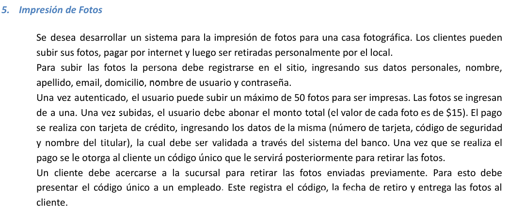

# eje5 👍

---

Persona > Usuario > Cliente 

Actores:

Empleado

Cliente

Usuario

Persona

Casos de uso: 

Registrarse V

Subir fotos V

Pagar con tarjeta V

~~abonar/pagar  // se resolvio en pagar tarjeta~~

Entregar fotos   V

Iniciar Sesion V

Cerrar Sesion V

Diagrama

A o B???

Se ve mas confiable el A

Si, era el A

A: 

B:

C:

Nombre del caso de uso: Iniciar Sesion

Descripcion: en este caso de uso se detalla el evento de iniciar sesion con el usuario y contrasenha

Actores: cliente registrado

PreCondicion: NULL

| Curso Normal | Accion del Actor | Acciones del sistema |
| --- | --- | --- |
|  | 1: el cliente selecciona iniciar sesion | 2: el sistema, le da un formulario, con los campos, nombre de usuario, contrasenha |
|  | 3: el cliente, ingresa sus datos y le da al boton de iniciar | 4: el sistema valida los datos |
|  |  | 5: el sistema, inicia la sesion y habilita las funcionalidades para el cliente |

Curso Alterno: 

paso 4 alterno: el cliente ingresa mal sus datos, el sistema lo redirige al paso 2

PostCondicion: iniciar sesion, habilitar las funciones para el cliente

---

Nombre del caso de uso: Cerrar Sesion

Descripcion: especifica el modo en el que los clientes cierran la sesion

Actores: 

Clientes

PreCondiciones: el usuario debe tener una sesion iniciada 

| Curso normal | Accion actor | Acciones del sistema |
| --- | --- | --- |
|  | 1: dado un cliente que se encuentra logueado, le da a cerrar sesion | 2: el sistema le pide una confirmacion, si quiere cerrar la sesion |
|  | 3: el cliente, confirma que quiere cerrar sesion | 4: el sistema cierra la sesion del cliente y se le quita las funcionalidades y se saca al cliente del sistema |
|  |  |  |

Curso Alterno: 

Paso 3 Alterno: el cliente, no confirma el cierre de sesion, se termina la CU

PostCondiciones: 

Cerrar la sesion, sacar al cliente del sistema

---

Nombre del caso de uso: Registrarse

Descripcion: en este caso de uso se especifica como una persona se debe registrar

Actores:

Persona

PreCondiciones: null

| Curso normal | Accion del Actor | Acciones del sistema |
| --- | --- | --- |
|  | 1: dado una persona cuando le da a iniciar sesion | 2: el sistema le muestra un formulario, donde tiene los campos.. nombre, apellido, email, domicilio, nombre de usuario, contrasenha |
|  | 3: la persona no registrada, ingresa sus datos y le da al boton de registrarse | 4: el sistema valida los datos |
|  |  | 5: el sistema, registra a la persona |

Cursono Alterno:

Paso 4 alterno: el sistema valida que los datos ingresados son erroneos, el sistema lo redirige al Paso 2

Paso 4: ya existe un usuario con los datos ingresados, se lo redirige al paso 2

PostCondicion:

Registrar a una persona

---

Nombre del caso de uso: Subir fotos

Descripcion: en este caso de uso se especifica como se deben subir fotos

Actores: 

Cliente

PreCondicion:

Cliente con inicio de sesion 

| Curso normal | Accion del actor | Acciones del sistema  |
| --- | --- | --- |
|  | 1: el cliente, toca subir fotos | 2: el sistema le presenta un apartado para subir fotos |
|  | 3: el cliente sube menos de 51 fotos y le da al boton de subir | 4: el sistema valida que sean menos de 51 fotos |
|  |  | 5: el sistema, lo redirige a ~~abonar~~  pagar con tarjeta, el monto total (otro caso de uso) |

CursoAlterno: 

Paso 4 alterno: el sistema valida que son mas de 50 fotos subidas, el sistema le informa que se paso del limite y lo redirige al paso 2

PostCondicion:

Se suben las fotos seleccionadas

---

Nombre del caso de uso: Pagar con tarjeta

Descripcion: en este caso de uso se describe como se debe pagar con tarjeta, las fotos

Actores:

Cliente, Servidor del banco

PreCondicion: se debe haber ejecutado la CU de “subir fotos”

| Curso normal | Accion del actor | Acciones del sistema |
| --- | --- | --- |
|  | 2: el cliente ingresa los datos | 1: el sistema le solicita el nro de tarjeta y cod de seguridad |
|  | 3: el servidor del banco acepta la conexion y le pide el nro de tarjeta y cod de seguirdad | 2: el sistema estable conexion con el sistema del banco |
|  | 5: el servidor del banco valida los datos | 4: el sistema le manda el nro de tarjeta y cod de seguirdad |
|  | 6: el servidor valida los fondos suficientes | 8: el sistema recibe que los datos de la tarjeta son correctos |
|  | 7: el servidor del banco le retorna el resultado | 9: el sistema recibe que los fondos son suficientes |
|  |  | 10: el sistema registra el pago y cierra la conexion con el sistema del banco |

Caso Alterno:

paso 2 alterno:  el sistema no logra establecer conexion con el sistema del banco. Termina la CU

paso5: el sistema del banco retorna que los datos no son validos, el sistema lo redirige al paso 1

paso 9: los fondos no son suficientes, lo redirige al paso 1

PostCondiciones:

Se realiza y registro el pago de la tarjeta

---

Nombre del caso de uso: Entregar fotos  

Descripcion: en este caso de uso se especifica como el empleado registra el cod unico y como debe entregar las fotos

Actores: Empleado, ~~Cliente~~

precondicion:

Null

| Curso normal | Accion del actor | Acciones del sistema |
| --- | --- | --- |
|  | 1: el empleado, le da al boton de entregar fotos | 2: el sistema le pide el cod unico |
|  | 3: el empleado carga el cod unico | 4: el sistema valida los datos |
|  | 6: el empleado entrega las fotos | 5: el sistema registra el codigo, la fecha  |
|  |  |  |

Curso Alterno: 

paso 4 alterno: falla en la validacion del codigo, termina la CU

PostCondiciones:

Entregar a un cliente las fotos y que quede registrado en el sistema

