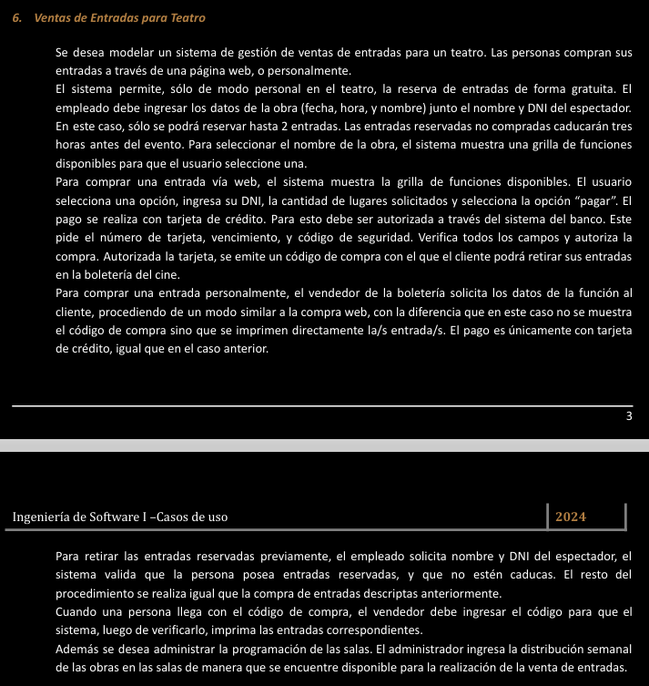

# eje6 👍

---

Casos de uso:

Reserva de entradas (Tomar reserva de entradas)

Mostrar una grilla

Comprar Entradas via Web

Comprar Entradas Personalmente

Retirar las entradas Reservadas

Retirar Entradas Compradas

Ingresar la distribucion semanal

Pagar con tarjeta

Pedir Datos Comun

Actores:

Usuario

Empleado

Administrador

Diagrama:

“Este seria el diagrama “ideal””, pero el enunciado te da a entender que el empleado, tambien (interactua con tu tarjeta)ingresa tu numero de tarjeta, vencimiento y cod de seguridad

“no deberia pero, asi se interpreta en el enunciado”

….

Quedaria algo asi (este estaria mal, mira mas abajo)

---

DIAGRAMA FINAL

Nombre del caso de uso: Retirar las entradas reservadas

Descripcion: en este caso de uso se detallan los pasos que realiza el empleado para darle las entradas al espectador

Actores:

Empleado

PreCondicion:

Null pointer exeption

| Curso Normal | Acciones del Actor | Acciones del sistema |
| --- | --- | --- |
|  | 1: el empleado selecciona “Retirar Reservas” | 2: el sistema le muestra un formulario con los campos: nombre, dni  |
|  | 3: el empleado ingresa los datos y le da al boton de “enviar” | 4: el sistema valida los datos |
|  |  | 5:  el sistema valida que posee entradas reservadas |
|  |  | 6: el sistema valida que no esten caducadas las reservas |
|  |  | 7: se ejecuta la CU de “Pagar con tarjeta” |
|  |  | 8: se imprimen las entradas |
|  |  | 9: se registra, la entrega de las entradas |

Curso Alterno:

7: falla la cu “Pagar Con Tarjeta”, se informa. Fin CU

5: el espectador no tiene entradas reservadas, se informa. “Fin de la cu”.

6: reservas caducadas, se informa. Fin de la CU.

PostCondicion:

el sistema imprime las entradas y se entregan las entradas reservadas

---

Nombre del caso de uso: Retirar las entradas Compradas

Descripcion: en este caso de uso se describen los pasos que realiza un empleado para dar las entradas a una persona, que ya compro entradas via web

Actores: Empleado

PreCondicion:

null

| Curso Normal | Acciones del Actor | Acciones del sistema |
| --- | --- | --- |
|  | 1: el empleado (vendedor) selecciona “retirar entradas compradas” | 2: el sistema le pide un codigo de compra |
|  | 3: el empleado (vendedor) ingresa el codigo de compra y le da al boton “siguiente” | 4: el sistema verifica el cod de compra |
|  |  | 5: el sistema imprime las entradas correspondiente |
|  |  | 6: el sistema registra la entrega de las entradas |

Curso Alterno:

4: cod de compra no valido. se informa. Se lo redirige al paso 2 “tal vez puso mal el cod?”

PostCondicion:

Entregar las entradas compradas impresas

---

Nombre del caso de uso: Comprar una entrada personalmente

Descripcion: en este caso de uso se describen los pasos que hace un empleado para tomar una compra de una persona, personalmente

Actores:

Empleado

PreCondicion:

Null

| Curso Normal | Acciones del Actor | Acciones del sistema |
| --- | --- | --- |
|  | 2: el cliente selecciona “Pagar” | 1: el sistema ejecuta la CU “Pedir Datos Comun” |
|  |  | 3: el sistema ejecuta la CU “pagar con tarjeta” |
|  |  | 4: el sistema imprime las entradas y cierra la conexion con el sistema del banco |

Curso Alterno:

1: Falla la CU pedir Datos Comun

3: Falla la Cu pagar con tarjeta 

PostCondicion:

Imprimir las entradas compradas

---

Nombre del caso de uso: Tomar Reserva de entrada

Descripcion: en este caso de uso se describe los pasos que hace un empleado para tomar la reserva de una entrada

Actores:

empleado

PreCondicion:

null

(parto desde: la persona ya me dio un nombre de una obra)

~~(Al tener una grilla, que me muestra las funciones disponibles, no puedo venir Pepe y decirme)~~

| Curso Normal | Acciones del Actor | Acciones del sistema |
| --- | --- | --- |
|  | 1: el empleado selecciona “reservar entradas” | 2: el sismte ejecuta la cu de “mostrar grilla” |
|  | 3: el empleado chequea que la obra este disponible en la grilla | 4: el sismte le muestra un formulario con los campos: fecha, hora, nombre de la obra.
Nombre y dni del espectador |
|  | 5: ingresa los datos y le da al boton “siguiente” | 6: el sistema le pide la cantidad de entradas a reservar |
|  | 7: el empleado ingresa el dato, le da al boton “siguiente” | 8: el sistema valida el dato |
|  |  | 9: el sistema registra la reserva |

Curso Alterno:

2: falla la Cu de mostrar grilla, se informa. Termina la CU

3: la obra pedida, no se encuentra dispnible. termina la CU

8: el cliente quiere pedir mas de 2 entradas para reserva no se puede, se informa. TERMINA LA CU

PostCondicion:

Realizar una reserva

---

Nombre del caso de uso: Mostrar grilla

Descripcion: en este caso de uso se detalla como el actor “Comportamiento en comun” selecciona una funcion disponible

Actores:

ComportamientoComun

PreCondicion:

Haberse ejecutado la CU de “Tomar Reserva” o “Comprar Una entrada Via Web”

| Curso Normal | Acciones del Actor | Acciones del sistema |
| --- | --- | --- |
|  | 2: el “CompartamientoComun” selecciona una y le da al boton de “seleccionar” | 1: el sistema muestra una grilla de funciones disponibles |
|  |  | 3: el sistema le muestra informacion sobre la obra seleccionada |

Curso Alterno:

PostCondicion:

Seleccionar una obra disponible

---

Nombre del caso de uso: Comprar una entrada via web

Descripcion: en este caso de uso se describen los paso que realiza el usuario para comprar una entrada via web

Actores:

Usuario

PreCondicion:

null

| Curso Normal | Acciones del Actor | Acciones del sistema |
| --- | --- | --- |
|  | 1: el Usuario selecciona “comprar entradas” | 2: el sistema ejecuta la CU “mostra grilla” |
|  |  | 3: el sistema ejecuta la CU “Pedir Datos Comun” |
|  |  | 4: el sistema ejecuta la CU “Pagar con tarjeta” |
|  |  | 5: el sistema registra la compra y emite un codigo de compra |

Curso Alterno:

2: Falla la CU “mostrar grilla”, termina la CU (”igual no podria fallar creo?”)

3: Falla la CU “pedir datos comun”, se informa, termina la CU

4: fALLA la CU “Pagar con tarjeta”, se informa, termina la CU

PostCondicion:

emitir un codigo de compra

---

Nombre del caso de uso: Ingresar distribucion semanal

Descripcion: “en este caso de uso se describe como un administrador, ingresa la distribucion semal de las obras”

Actores:

Administrador

PreCondicion:

null

| Curso Normal | Acciones del Actor | Acciones del sistema |
| --- | --- | --- |
|  | 1: el administador selecciona “ingresar distribucion semalan” | 2: el sistema le muestra un formulario para llenar, con la distribucion semanal |
|  | 3: el administrador, llena los datos y le da al boton de “enviar” | 4: el sistema valida los datos  |
|  |  | 5: el sistema registra la distribucion semanal para las obras |

Curso Alterno:

PostCondicion:

Cargar la distribucion semanal de las obras

---

Preguntar————si ESTo esta bien o como puedo llegar a modelar algo como esto, cuando quiero englobar comportamiento comun de casos de usos————

Nombre del caso de uso: Pedir Comun

Descripcion: en este caso de uso se describe como el sistema les pide datos a un usuario o empleado

Actores:

ComportamientoComun

PreCondicion:

Haber ejecutado las CU” Comprar entradas personalmente o Comprar entradas via web”

| Curso Normal | Acciones del Actor | Acciones del sistema |
| --- | --- | --- |
|  | 2: el actor“ ComportamientoComun” ingresa los datos y le da a enviar | 1: el sistema le muestra un formulario con los campos: dni, cant de lugares |
|  |  | 3: el sistema valida el dni |
|  |  | 4: el sistema valida la cantidad de lugares |
|  |  | 5: el sistema registra los datos |

Curso Alterno:

3: el dni contiene letras?. fin de la cu

4: no se cuenta con la cantidad de lugares pedida, se informa. termina la CU

PostCondicion:

Registrar los datos ingresados

---

Nombre de la cu: Pagar con tarjeta

PrecONDICIONES:

hABER ejecuta la cu “comprar una entrada personalmente” o “Retirar las entradas reservadas” o “Comprar via web”

aCtores:

Sistema del banco

Comportamiento Comun

| Curso normal | ACCIONES DEL ACTOR | Acciones del sistema |
| --- | --- | --- |
|  | 2- El Comportamiento Comun ingresa los datos solicitados
5- El servicio de banco solicita los datos de la tarjeta
7- El servicio de banco verifica los datos ingresados
8- El servicio de banco retorna el resultado
 | 1- El sistema solicita los datos de la tarjeta (numero de tarjeta, vencimiento y código de seguridad)
3- El sistema verifica los datos de la tarjeta
4- El sistema se conecta con el servicio de banco
6- El sistema ingresa los datos solicitados
9- El sistema recibe respuesta
 |
|  |  |  |

Curso Altenro:

3- Se encuentra campo vació, se informa. Se vuelve al paso 5
4- Error de conexión con el servidor de de banco. Se informa. Fin de caso de uso
7a- El numero de tarjeta no corresponde a una tarjeta de crédito. Se informa discrepancia. Fin de caso de uso
7b- El código de seguridad no corresponde a la tarjeta ingresada. Se informa . Fin de caso de uso
7c- La tarjeta no cuenta con saldo suficiente. Se informa. Fin de caso de uso

PostCondiciones:

Se realiza la compra de la entrada

---