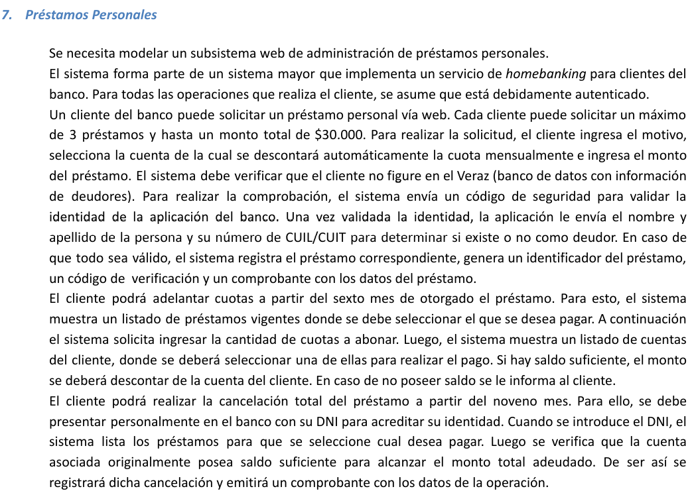

# eje7 👍

---

Actores:

Cliente

Veraz

Casos de uso:

SOlicitar prestamo

Realizar COmprobacion

Adelantar (Cuotas)

~~Realizar pago~~

Cancelacion

Diagrama:

Si sigo el enunciado el diagrama es este

Si se sigue la logica de como funcionaria de manera mas realista, seria algo como (pero nunca menciona al Actor “empleado”)

Nombre la cu:  SOlicitar prestamo

Descripcion: en este caso de uso se describe como un cliente, solicita un prestamo

Actores:

Cliente (autenticado)

PreCondiciones:

Null

| Curso Normal | Acciones del actor | Acciones del sistema |
| --- | --- | --- |
|  | 1: el Cliente (autenticado) selecciona “Solicitar Prestamo” | 2: el sistema le pide el motivo y le lista las cuentas de las cuales se puede descontar automaticamente y el monto |
|  | 3: el cliente (autenticado), ingresa el motivo y selecciona una cuenta de la que se descontara automaticamente e ingresa el monto y le da al boton de “solicitar” | 4: el sistema valida que no haya solicitado mas de 3 prestamos |
|  |  | 5: el sistema valida que el monto no supera el monto total de $30000 |
|  |  | 6:  el sistema ejecuta la CU de “Veraz” |
|  |  | 7: el sistema registra el prestamo y genera un identificador del prestamo, un codigo de verificacion y un comprobante con datos del prestamo |

Curso Alterno:

4 alterno: el cliente (autenticado) ya supera los 3 prestamos. Termina la cu

5 alterno: el cliente (autenticado) supera los 30000, se le informa. Termina la cu

6 alterno: falla la Cu “Veraz”, fin de la cu

PostCondiciones

Que se registre el prestamo

---

Nombre la cu:  Realizar COmprobacion

Descripcion: en esta cu, se describe como el sistema realiza la comprobacion (a travez de un banco de datos)que cliente no sea Veraz

Actores:

Veraz (servidor externo)

PreCondiciones:

que se haya ejecutado anteriormente la CU de solicitar prestamo

| Curso Normal | Acciones del actor | Acciones del sistema |
| --- | --- | --- |
|  | 2: el servidor externo, le solicita un codigo de seguridad | 1: el sistema solicita conexion con el servidor externo |
|  | 4: el servidor externo valida el cod de seguridad  | 3: el sistema le manda un codigo de seguridad para validar la identidad de la app del banco |
|  | 5: el servidor externo estable conexion con el sistema | 7: el sistema le envia los datos |
|  | 6: el servidor externo le pide nombre y apellido de la persona y su nro de cuil/cuit | 10: el sistema recibe que el cliente no figura en “Veraz” |
|  | 8: el servidor externo valida los datos | 11: el sistema cierra conexion con el servidor externo |
|  | 9: el servidor externo retorna el resultado |  |

Curso Alterno:

1: el sistema no logra una conexion con el servidor externo. FINALIZA LA CU

4: el cod de seguridad no es valido, se informa. Termina la CU

10: el sistema recibe que el cliente figura como veraz, se informa. Termina la cu

PostCondiciones

Validar si un cliente figura como veraz

---

Nombre la cu:  Adelantar (Cuotas)

Descripcion:

en este caso de uso se describe como es el proceso para que un cliente adelante cuotas de un prestamo

Actores:

Cliente

PreCondiciones:

null

| Curso Normal | Acciones del actor | Acciones del sistema |
| --- | --- | --- |
|  | 1: el cliente selecciona “adelantar cuotas” | 2: el sistema le muestra un listado de prestamos vigentes, donde debe seleccionar el que desea pagar |
|  | 3: el cliente selecciona el prestamo que desea pagar  | 4: el sistema valida que el prestamo ya fue otorgado hace mas de 6 meses |
|  |  | 5: el sistema le solicita la cantidad de cuotas a abonar |
|  | 6: el cliente ingresa la cantidad cuotas y le da al boton de “siguiente“  | 
7: el sistema le muestra un listado de cuentas para abonar |
|  | 8: el cliente elige una cuenta y le da al boton de “siguiente”  | 9:  el sistema valida que haya saldo suficiente |
|  |  | 10: el sistema descuenta el monto de la cuenta del cliente sleccionada (la cantidad de cuotas) |

Curso Alterno:

4: el prestamo fue otorgado hace menos de 6 meses. Fin de la CU

9: cuenta sin saldo suficiente, se informa. Se lo redirige al paso 7

 2: el sistema no tiene prestamos vigentes, se informa. Fin de la cu

6: el cliente introduce una cantidad de cuotas mayor a las cuotas restantes. Se lo redirige al paso 5

PostCondiciones

adelantar cuotas de un prestamo

---

Nombre la cu: Cancelacion

Descripcion: en este caso de uso se describe los pasos para cancelar un prestamo

Actores:

Empleado

PreCondiciones:

null

| Curso Normal | Acciones del actor | Acciones del sistema |
| --- | --- | --- |
|  | 1: el empleado selecciona “cencelar prestamo” | 2: el sistema le solicita el dni |
|  | 3: el empleado introduce el dni y le da al boton de “siguiente” | 4: el sistema valida el dni

5: el sistema lista los prestamos vigentes para que seleccione uno |
|  | 6: el empleado selecciona uno y le da a “siguiente” | 7: el sistema valida que el prestamo lleve mas de 8 meses |
|  |  | 8: el sistema valida que cuente con saldo suficiente, en la cuenta asociada originalmente |
|  |  | 9: el sistema registra la cancelacion del pago y emite un comprobante con los datos de la operacion |

Curso Alterno:

4: el dni no pertenece a una cuenta, se informa. FIN DE LA CU

5: no hay prestamos activos. fin de la cu

7: el sistema valida que el prestamo lleva menos de 9 meses. fin del cu

8: la cuenta asociada no tiene saldo suficiente como para cancelar la deuda. fin de la cu

PostCondiciones

que se cancele un prestamo y se emita un comprobante con los datos de la opracion 

---

Nombre la cu: 

Descripcion:

Actores:

PreCondiciones:

| Curso Normal | Acciones del actor | Acciones del sistema |
| --- | --- | --- |
|  |  |  |
|  |  |  |

Curso Alterno:

PostCondiciones