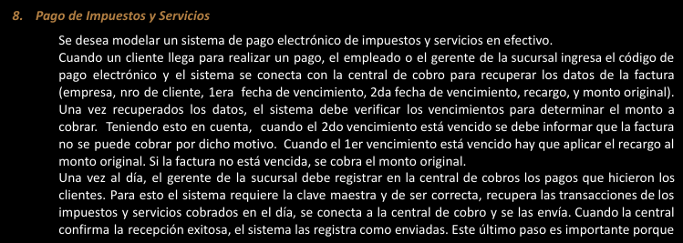

# eje8 👍

---

(falto la flecha gerente —> ver estadisticas)

Entiendo que conecct, va tener como pre, ejecutar anteriormente la cu de envios O recuperar…
Tambien que conecct es una CU resumen “caso resumen”

ESTE ES EL Q VA?

Casos de uso:

Realizar Pago/cobro

Registrar los pagos

ver estadisticas

Recuperar Factura

Envio de cobros

Conectarse al servidor externo

Actores:

Empleado 

Gerente

Central De Cobros

Nombre de la CU:  Realizar Pago

Descripcion: En esta CU se describe como un UsuarioComun realizan un cobro

PreCondiciones:

Null

Actores:

Usuario Comun

| Curso Normal | Acciones del Actor | Acciones del sistema |
| --- | --- | --- |
|  | 1: el UsuarioComun selecciona “Realizar Pago” | 2: el sistema le pide un codigo de pago electronico |
|  | 3: el usuarioComun ingresa el cod y le da al boton de “siguiente” | 4: el sistema ejecuta la CU de “Recuperar Factura” |
|  |  | 5: El sistema recibe los datos  |
|  |  | 6: Si el 2do vencimiento esta vencido |
|  |  | 6.1: se informa que la factura no se puede cobrar(este nose si entraria en el curso normal) |
|  |  | 7: Si el 1er vencimiento esta vencido |
|  |  | 7.1: hay que aplicar el recargo al monto original. |
|  |  | 8: Si no esta vencida, se cobra el monto original |
|  |  | 9: Se registra el cobro de la factura |

Preguntar

“puede ser que modele bien el Curso normal, puse el caso donde puede explotar la CU, pero al final, paso 9, puse que se registra el cobro de la factura, dando a entender que entro en el paso 7 o 8”

Curso Alterno: 

4: fallo en la CU de “Recuperar Factura”. Se termina la CU

6.1: explota la CU, se cumple este caso. Se termina la CU

PostCondiciones: 

Se registre el cobro de una factura

---

Nombre de la CU: Registrar los pagos

Descripcion: en este caso de uso se describe como un Gerente registra los pagos en la central de cobros

PreCondiciones:

Actores: Gerente

| Curso Normal | Acciones del Actor | Acciones del sistema |
| --- | --- | --- |
|  | 1: el gerente selecciona “registrar pagos” | 2: el sistema le pide una clave maestra |
|  | 3: el gerente ingresa la clave maestra y le da al  boton de “siguiente” | 4: el sistema valida la clave |
|  |  | 5: el sistema recupera las trasnsaciones e impuestos y servicios cobrados en el dia |
|  |  | 6: el sistema ejecuta la CU de “conectarse al servidor externo” |
|  |  | 7: el sistema le envia los datos al servidor externo |
|  |  | 8: el sistema recibe el estado del envio |
|  |  | 9: el sistema registra como enviadas ~~y cierra la conexion con el servidor externo~~ |

Curso Alterno: 

4: clave maestra erronea, se informa y se redirige al paso 2

5: falla en la recuperacion de datos, ya se hizo un envio de transacciones del dia, se informa y termina la CU

6: falla la CU de “conectarse al servidor externo”, se informa y termina la CU

8: el sistema recibe un estado de recepcion fallida. Se termina la CU

PostCondiciones: 

el sistema registre el envio de las transacciones del dia

---

Nombre de la CU: ver estadisticas

Descripcion: en esta cu, se describe como los pasos  que hace el gerente para visualizar las estadisticas

PreCondiciones: 

null

Actores:

gerente

| Curso Normal | Acciones del Actor | Acciones del sistema |
| --- | --- | --- |
|  | 1: el gerente selecciona “ver estadisticas” | 2: el sistema le pide una clave maestra y un rango de fechas |
|  | 3: el gerente ingresa los datos y le da al boton de “enviar” | 4: el sistema valida la clave  |
|  |  | 5: el sistema valida el rango de fechas |
|  |  | 6: el sistema muestra los montos y cantidades de cobros realizados , agrupados por empresa |
|  |  |  |

Curso Alterno: 

4: clave no valida, se informa. Se lo redirige al paso 2

5: rango de fechas no valido. Se informa y se lo redirige al paso 2

PostCondiciones: 

Mostrar las estadisticas de los montos/cantidades agrupados por empresa

---

Nombre de la CU:  Recuperar Factura

Descripcion: en este caso de uso se describe como se recuperan los datos de la factura

PreCondiciones:

hABER ejecutado anteriormente la CU de “Realizar Pago”

Actores:

Central de cobros

| Curso Normal | Acciones del Actor | Acciones del sistema |
| --- | --- | --- |
|  | 3: la central de cobros valida el codigo | 1: se ejecuta la CU “conectarse con el servidor externo” |
|  | 4: la central envia (empresa, nro de cliente, 1era fecha de vencimiento, 2da fecha de vencimiento, recargo, y monto original) | 2: el sistema le envia el codigo de pago electronico |
|  |  | 5: el sistema recibe los datos |
|  |  | 6: el sistema cierra la conexion con servidor externo |

Curso Alterno: 

1: fallo en la CU ejecutada, se informa. Termina la CU

3: fallo en el codigo. termina la CU

PostCondiciones: 

el sistema reciba la factura

---

Nombre de la CU: Envio de cobros

Descripcion: en este caso de uso se describe como se realiza un envio de cobros

PreCondiciones: haber ejecutado anteriormente “registrar los pago”

Actores:

Central de cobros

| Curso Normal | Acciones del Actor | Acciones del sistema |
| --- | --- | --- |
|  | 3: la central recibe las transacciones del dia | 1: se ejecuta la CU “Conectarse al servidor externo” |
|  | 4: la central manda una confirmacion al sistema | 2: el sistema envia las transacciones/cobros del dia |
|  |  | 5: el sistema recibe el estado |
|  |  | 6: el sistema registra cocomo enviados los cobros del dia y cierra conexion con el servidor externo |

Curso Alterno: 

1: falla la cu, se informa. fin de la cu

PostCondiciones: 

enviar a la central de cobros, los pagos del dia

---

Nombre de la CU:  Conectarse al servidor externo

Descripcion:  En este CU se detallan los pasos para validar el token y establecer conexión con la central de cobros.

PreCondiciones:

Haber realizado el CU “Recuperar datos factura ” o “enviar cobros”

Actores:

| Curso Normal | Acciones del Actor | Acciones del sistema |
| --- | --- | --- |
|  | 2: el servidor externo le pide el token | 1: el sistema solicita conexion con el servidor externo |
|  | 4: el servidor valida el token | 3: el sistema le envia el token |
|  | 5 el servidor establece conexion con el sistema | 7: el sistema recibe el resultado |
|  | 6: el servidor retorna el resultado |  |
|  |  |  |

Curso Alterno: 

1: error en la conexion. termina la cu

7: el token no es valido. fin cu

PostCondiciones: 

Establecer conexion con el servidor

