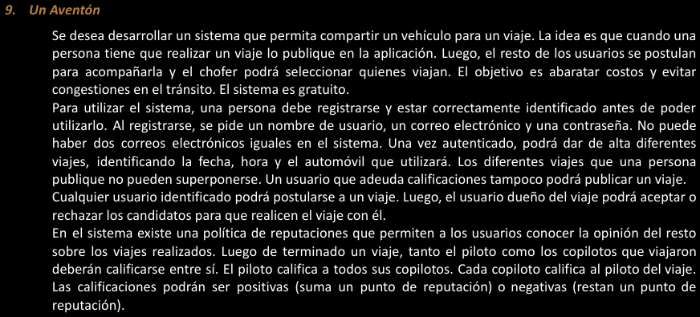

# eje9 👍

---

Actores

Usuario

Persona

Piloto

Copiloto

Casos de Uso

Registrarse 

Iniciar Sesion

Cerrra Sesion

Publicar Viaje

Postularse

Administrar Viaje

Calificar Viaje

Diagrama

Nombre de caso de uso: Registrarse

Descripcion: en este caso de uso se describe como es el proceso de registro de una persona no registrada

Actores: Persona (no registrada)

PreCondicion: ~~No puedo haber 2 correos electronicos iguales~~

| Curso Normal | Acciones del actor | Acciones del sistema |
| --- | --- | --- |
|  | 1: la persona selecciona “Registrarse” | 2: el sistema, le muestra un formulario con los campos: nombre de usuario, correo electronico, contrasenha |
|  | 3: la persona no registrada, ingresa los datos y le da al boton de Registrarse  | 4: el sistema valida los datos |
|  |  | 5: El sistema valida que el mail no existe en el sistema |
|  |  | 6: El sistema registra en el sistema a la persona |

Curso Alterno:

5: el mail ya existe en el sistema, se informa, lo redirige al paso 2

PostCondicion:

dado una persona no registrada, se registra en el sistema un nuevo usuario

---

Nombre del caso de uso: Iniciar Sesion

Descripcion: en este caso de uso se describe como un Usuario registrado, inicia sesion en el sistema

Actores: Usuario Registrado

PreCondicion: El usuario debe estar Registrado

| Curso Normal | Acciones del usuario | Acciones del sistema |
| --- | --- | --- |
|  | 1: El usuario Registrado, selecciona Iniciar Sesion | 2: El sistema le muestra un formulario, que le pide mail, nombre de usuario y contrasenha |
|  | 3: el usuario Registrado, llena los datos y le da al boton de iniciar sesion | 4: el sistema valida los datos |
|  |  | 5: el sistema verifica el mail |
|  |  | 6: el sistema verifica el nombre de usuario |
|  |  | 7: el sistema verifica la contrasenha |
|  |  | 8: el sistema le da acceso y le habilita las funciones de usuario |

Curso Alterno: 

5: no existe el mail, se lo redirige al paso 2

6: no existe el nombre de usuario, se lo redirige al paso 2

7: la contrasenha es incorrecta, se informa y se vuelve al paso 2

PostCondicion: 

Dado un usuario registrado, que pueda iniciar sesion y que se habiliten las funcionalidades para los usuarios

---

Nombre del caso de uso: Cerrar Sesion 

Descripcion: en este caso de uso se describen los paso para que un usuario registrado pueda cerrar sesion

Actores:

Usuario Registrado

PreCondicion: 

Que el usuario tenga una sesion iniciada

| Curso Normal | Acciones del usuario | Acciones del sistema |
| --- | --- | --- |
|  | 1: el usuario registrado, selecciona cerrar sesion | 2: el sistema le pide que confirme que quiere cerrar sesion |
|  | 3: el usuario registrado, confirma que quiere cerrar sesion | 4: el sistema cierra la sesion y le quita las funcionaliades para los usuarios |

Curso Alterno:

3:  el usuario registrado, no confirma que quiere cerrar sesion. FIN DE CU

PostCondicion: 

Dado un usuario registrado, que pueda cerrar sesion

---

Nombre del caso de uso: Publicar Viaje

Descripcion: Permite a un usuario registrado y autenticado publicar un viaje indicando detalles como fecha, hora y el automóvil a utilizar.

Actores: Piloto

PreCondicion: 

- El usuario debe estar registrado en el sistema con un nombre de usuario, correo electrónico y contraseña.
- El usuario debe estar autenticado.
- El usuario no debe tener adeudo de calificaciones.
- No debe haber viajes que se superpongan (fecha y hora) con los que el usuario ha publicado.

| Curso Normal | Acciones del usuario | Acciones del sistema |
| --- | --- | --- |
|  | 1: Un piloto que ingresa a “publicar viaje” | 2: el sistema le muestra un formulario con los campos: fecha, hora y el automovil |
|  | 3: el piloto llena los datos y le da al boton de publicar viaje | 4: el sistema valida los datos |
|  |  | 5: valida la fecha |
|  |  | 6: valida que no adeude calificaciones |
|  |  | 7: el sistema crea el viaje |
|  | 8: el piloto publica el viaje | 9: el sistema registra la publicacion |

Curso Alterno:

5: el piloto, pone una fecha que ya paso. lo redirige al paso 2

6: el piloto adeuda calificaciones. Termina LA CU

PostCondicion:

- El viaje se ha registrado correctamente en el sistema.
- Otros usuarios pueden postularse para el viaje publicado.

---

Nombre de la CU: Postularse

Descripcion: en este caso de uso de detalla como un copiloto puede postularse a un viaje

Actores: Copiloto

PreCondiciones: 

- El usuario debe estar registrado y autenticado en el sistema.
- Debe haber un viaje disponible para postularse (ya publicado por un piloto).
- El usuario no debe haber sido rechazado previamente para el mismo viaje.

| Curso Normal | Acciones del actor | Acciones del sistema |
| --- | --- | --- |
|  | 1: Un usuario, selecciona “postularse para copiloto” | 2: el sistema le muestra detalles de los viajes fecha hora, automovil y piloto |
|  |  | 3: el sistema valida que no haya sido rechazado previamente en esa publicacion |
|  |  | 4: el sistema le pide una confirmacion de sus postulacion al usuario |
|  | 5: el usuario, confirma su postulacion | 6: el sistema notifica al piloto que tiene un nuevo postulante |

Curso Alterno

3: el sistema valida que fue rechazado anteriormente en esa publicacion, le informa y termina la CU

PostCondicion:

El sistema haya registrado la postulacion de un usuario para copiloto

---

Nombre del caso de uso: Administrar Viaje

Descripcion: En este caso de uso se describe como un piloto que ha hecho una publicacion de un viaje, acepta o rechaza a copilotos

Actores:

Copiloto

PreCondiciones:

El copiloto debe estar autenticado y registrado

| Curso Normal | Acciones del actor | Acciones del sistema |
| --- | --- | --- |
|  | 1: el piloto, selecciona “Administrar Viaje” | 2: el sistema le muestra a los usuarios postulados para su publicacion |
|  | 3: el piloto, acepta o rechaza a los postulante | 4: el sistema registra el estado de las postulaciones |
|  |  |  |

Curso Alterno: 

PostCondicones:

Registrar estado de postulaciones del viaje

---

nombre la CU: Calificar Viaje

Descripcion: en este caso de uso se describe como se califican los pilotos y copilitos

Actores:

piloto

copilotos

PreCondicion:

el viaje debe haber sido compleado

el usuario debe estar autenticado en el sistema

| Curso Normal | Acciones del Actor | Acciones del sistema |
| --- | --- | --- |
|  | 1: el usuario accede a la seccion de viajes realizados | 2: el sistema valida el rol de ese usuario en el viaje |
|  |  | 3: el sistema le muestra un formulario para calificar  |
|  |  | 3.1 si es piloto le muestra un formulario para calificar a los copilotos |
|  |  | 3.2 si es copiloto, le muestra un formulario para calificar al piloto |
|  | 4: el usuario elige una calificacion positiva o negativa y le da al botond enviar | 5: el sistema registra la calificacion y actualiza la reputacion del usuario calificado |

Curso Alterno: null

PostCondicion: que el usuario participante del viaje sea calificado

---

Nombre de caso de uso:

Descripcion:

Actores:

PreCondiciones:

| Curso Normal | Acciones del actor | Acciones del sistema |
| --- | --- | --- |
|  |  |  |
|  |  |  |

Curso Alterno: 

PostCondicones:

